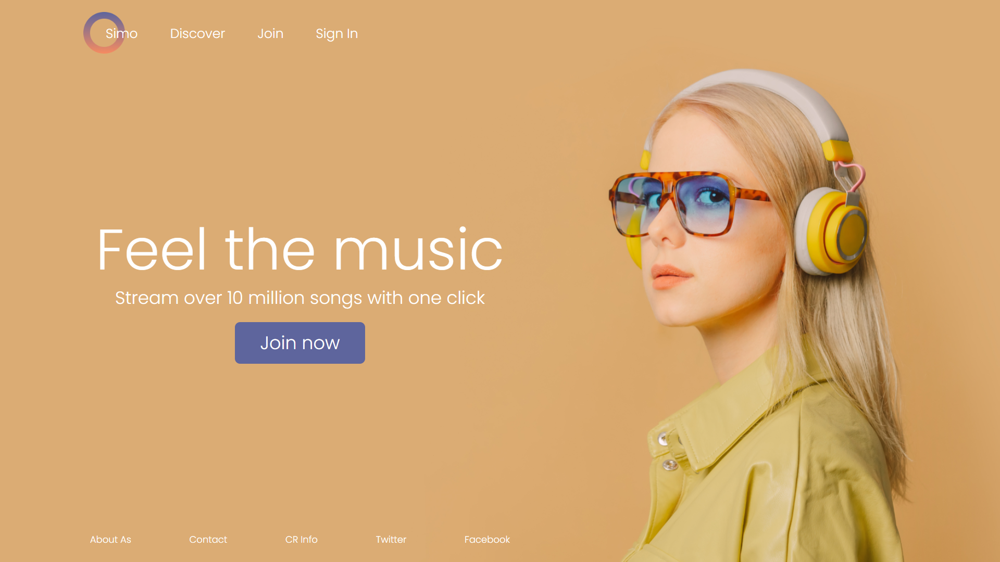

<h1 align="center">
  Music Site
</h1>
<h1 align="center">

</h1>

 <a href="#-sobre-o-projeto">{c:#B81365}Sobre{/c}</a> •
 <a href="#-layout">Layout</a> • 
 <a href="#-tecnologias">Tecnologias</a> • 
 <a href="#user-content--licença">Licença</a>

## 💻 Sobre o projeto

Music Site é uma Landing Page desenvolvida no Figma por <a class="link__" href="https://www.figma.com/@massonjs">Masson Simon</a>. Caso queira estudar o projeto, o link está <a class="link__" href="">aqui</a>.

---

## 🎨 Layout

O layout da aplicação está disponível abaixo:

### Web

  

---

## 🚀 Tecnologias
---

As seguintes ferramentas foram usadas na construção do projeto:

#### **Website**

- <a class="link__" href="https://www.w3schools.com/html/">HTML</a>
- <a class="link__" href="https://www.w3schools.com/css/default.asp">CSS</a>
- <a class="link__" href="https://www.figma.com/">FIGMA</a>
- <a class="link__" href="https://code.visualstudio.com/">VSCODE</a>

## 🚧 Projeto
---

Live Preview: 

## 🎨 Layout:
---

Figma: <a href="https://www.figma.com/community/file/1140995588614722532" class="link__">https://www.figma.com/community/file/1140995588614722532</a>

## 📝 Licença
---

Esse projeto está sob a licença MIT. Veja o arquivo [LICENSE](LICENSE) para mais detalhes.

---

Coded com ❤️ por Elvis da Silva 👋🏽 <a class="link__" href="https://www.linkedin.com/in/elvisdasilva">Entre em contato</a>

---
